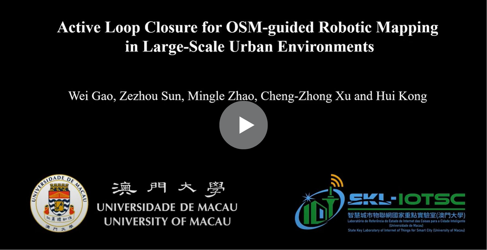

This is the code repository for the IROS'24 paper "Active Loop Closure for OSM-guided Robotic Mapping in Large-Scale Urban Environment"

# 

[](https://www.youtube.com/watch?v=jHr28Vx-M-M "Active Loop Closure for OSM-guided Robotic Mapping in Large-Scale Urban Environment")

# Usage:
The repository has been tested in Ubuntu 20.04 with ROS Noetic. To setup OSM-guided Active Loop Closure(ALC), install the dependencies with command lines below.
- Dependencies

1. [mlpack](https://github.com/mlpack/mlpack)
2. [Opencv 4.2](https://github.com/opencv/opencv)
3. Eigen3
4. [PCL 1.13.1](https://github.com/PointCloudLibrary/pcl)
5. OpenMP
6. [gtsam 4.0.2](https://github.com/borglab/gtsam)

- Quick Start
```bash
### front end ###
roslaunch fast_lio mapping_avia_rot.launch

### terrain_analysis ###
roslaunch vehicle_simulator system_real_robot.launch

### waypoint ###
roslaunch osmplanner osmplanner.launch

### gps follow ###
roslaunch gps_follow ini_gps.launch

### active loop closure ###
roslaunch gps_follow active_loop.launch

### back end ###
roslaunch aloam_velodyne fastlio_ouster64.launch

```

# Reference:
Wei Gao, Zezhou Sun, Mingle Zhao, Chengzhong Xu, and Hui Kong, Active Loop Closure for OSM-guided Robotic Mapping in Large-Scale Urban Environment, 
IEEE International Conference on Intelligent Robotics and Systems (IROS), 2024. [[**PDF**](https://arxiv.org/pdf/2407.17078)]
